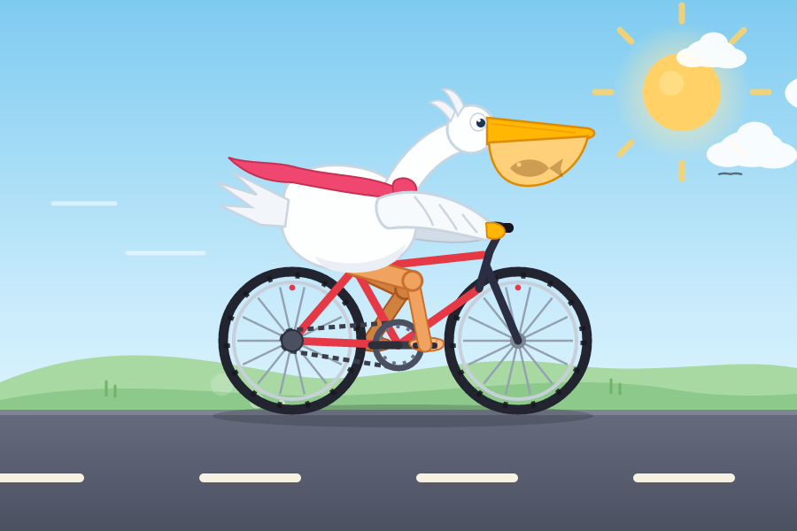

# 鹈鹕骑自行车 · Pelican on a Bicycle 🚲

一只白色鹈鹕骑着红色自行车的**纯 SVG + SMIL 动画** —— 不依赖 JavaScript、图片或任何外部资源。
A white pelican riding a red bicycle, animated with **pure SVG + SMIL**. No JavaScript,
no images, no external assets — `pelican-bicycle.svg` plays on its own in any browser,
in an `` tag, or in design tools.



## 文件 / Files

| 文件 | 说明 |
| --- | --- |
| `pelican-bicycle.svg` | 成品动画（交付物）。单独打开即可播放。 |
| `index.html` | 演示页：内联同一份 SVG，带 播放/暂停、重播、调速、隐藏背景 控件。 |
| `build.py` | SVG 生成器。改几何/配色/时间后运行 `python3 build.py` 重新生成。 |
| `verify.py` | 校验器：结构检查 + 运动学检查 + 用 resvg 逐帧烘焙出 PNG 预览。 |
| `render-frame.js` | verify.py 用的单帧光栅化脚本（需要 `npm install`）。 |

## 看动画 / Viewing

```bash
# 方式一：直接打开
open pelican-bicycle.svg        # 或 index.html

# 方式二：起一个本地服务（含下载链接）
python3 -m http.server 8000 --bind 0.0.0.0
```

## 动画里有什么 / What moves

- **踏板沿曲柄圆运动**，双腿用两骨反向运动学（IK）逐帧求解，脚始终踩在踏板上；
  链条转速、车轮转速按 26t/12t 齿比联动。
- 车轮辐条旋转、链条滚动、路面标线后移、尘土飞扬、速度线掠过。
- 鹈鹕身体随踩踏轻微起伏、眨眼、喉囊里有一条鱼在摆动、围巾迎风飘动。
- 车铃每几秒响一次；云、飞鸟、太阳光芒缓慢漂移。

## 重新生成与校验 / Regenerate & verify

```bash
python3 build.py      # 重新生成 svg + html
npm install           # 一次性安装 @resvg/resvg-js
python3 verify.py     # 结构 + 运动学检查，并在 frames/ 下渲染若干帧 PNG
```

`verify.py` 直接读取**交付的 .svg**，在给定时间点把每个 `<animate>` 的值解算出来烘焙成静态帧再光栅化，
因此 `frames/*.png` 展示的就是你拿到的文件本身。
